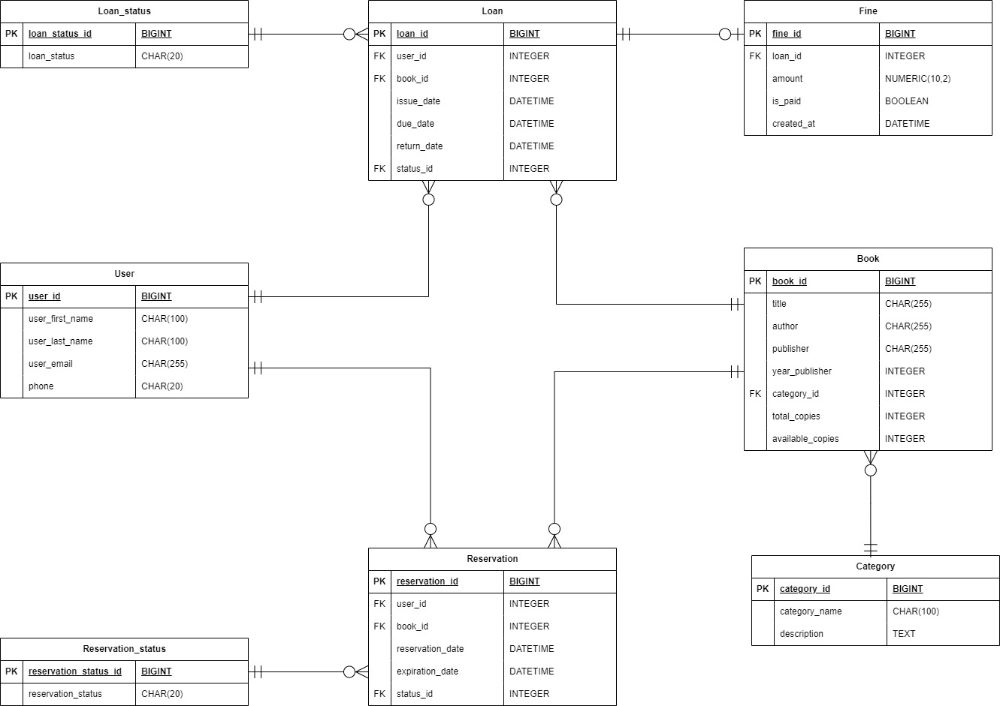

# Library Management System

Проект представляет собой систему управления библиотекой, реализованную на **Spring Boot** с использованием **JPA/Hibernate** и PostgreSQL.  
Система позволяет управлять пользователями, книгами, категориями, бронированиями и выдачами книг.

---

## Схема базы данных (ERD)

Ниже представлена диаграмма связей сущностей (Entity Relationship Diagram):



---

## Тестирование

- Используется **JUnit 5**, **Mockito**
- Тесты покрывают:
    - Позитивные кейсы (успешное добавление/удаление)
    - Негативные кейсы (откат транзакций при ошибках)

---

## Настройка и запуск

1. Настройте PostgreSQL базу данных
2. Измените настройки подключения в `application.properties`:
```properties
spring.datasource.url=jdbc:postgresql://localhost:5432/library
spring.datasource.username=your_username
spring.datasource.password=your_password
spring.jpa.hibernate.ddl-auto=update
